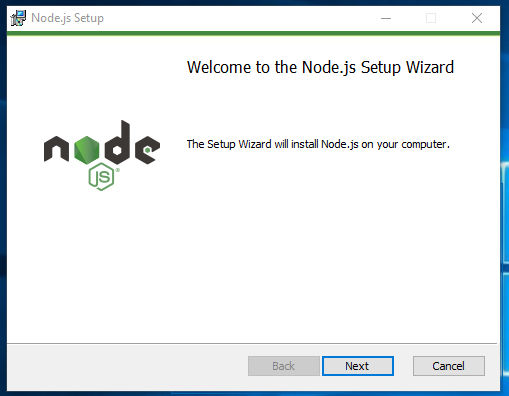
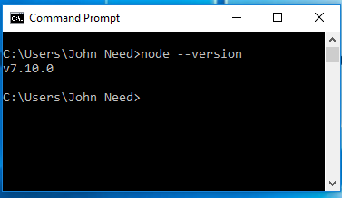
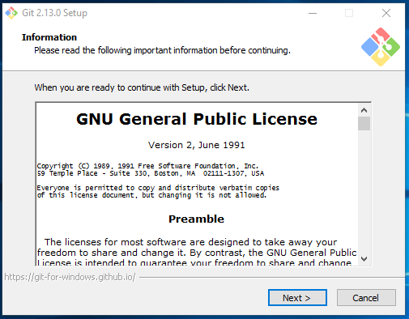

# Getting Setup on Windows

Getting Setup on Windows
These instructions are for Windows 10 - 64 bit.   
Install Node

1. Download the Node installer here : https://nodejs.org/en/

2. Launch the installer.
    


3. Click through the installer accepting all the default settings.

6. Verify that Node  is installed by opening a terminal and typing `node --version`  you should see version number for Git.

    


Install and Configure Git

1. Download the Git installer here : https://git-scm.com/download/win

2. Launch the installer.

    


3. Click through the installer accepting all the default settings.

4. Verify that Node  is installed by opening a terminal and typing `git --version`  you should see something like:

     ````git version 2.14.0.windows.1````


5. Set your name and email in Git using the following commands in the terminal.

    ```git config --global user.name "YOUR NAME"```
    ```git config --global user.email your.email@somecompany.com```


Install Python 2.7.15
  
1. In the Command Prompt window, type the following and press Enter.

    `python`

    If Python is installed and in your path, then this command will run python.exe and show you the version number.

    `Python 2.7.4 (r264:75708, Oct 10 2009, 07:36:50) [MSC v.1500 64 bit (AMD64)] on win32 Type "help", "copyright", "credits" or "license" for further information.`

    Otherwise, you will see:

    `'python' is not recognized as an internal or external command, operable program or batch file.`

    If you don't have python 2.7, you need to download, install, and then add it to your path.
 
2. Download and install Python 2.7.15 for Windows
    
    Go to https://www.python.org/downloads/release/python-2715
    
    Find and download the Windows installer file that matches your system.
   
    Open the file to start the installation wizard.
    Follow the instructions and make a note of where Python is installed on your system.
 
3. Add Python to path
    In the Windows menu, search for “advanced system settings” and select View advanced system settings.
    In the window that appears, click Environment Variables… near the bottom right.
     

 
Open the file to start the installation wizard.

Follow the instructions and make a note of where Python is installed on your system.In the next window, find and select the user variable named Path and click Edit… to change its value. The value for this variable is a semi-colon-delimited list of file locations.
Scroll to the end of the value, add a semicolon, and then add the location of python.exe. (If you do not know where your python.exe is, you can search for it.)
Click OK to save this change.
If you do not have a user variable named Path, click the New… button.
Add a variable named Path and make its value the location of python.exe.
 
Finding python.exe
If you do not know where Python was installed, search for python.exe in the Windows menu.
Right-click the file name in the results, select Properties, and find Location.
Copy the location and add it to your path variable.
 
Confirm addition to path
Open a new command prompt and re-run the original command:
python


to confirm that Python 2.7.15 is installed and added to your path.


Install Android Studio

1	


Install and Configure Genymotion 
Genymotion is the easiest way to get an Android emulator up and running.  With Expo, you can use your phone, but you're probably going to want to use a simulator.

1.  Go to the Genymotion "Fun-Zone" and create an account.  You'll need ti to download the "free for personal use" version of Genymotion : 

https://www.genymotion.com/fun-zone/

2.  Once you have your account, go back to the website and download the "with VirtualBox" version. If you install the "without VirtualBox" version you'll need to install VirtualBox separately.
 

3. Run the installer.


Install Firebase Tools
Before you can use the Firebase tools you'll need a free account.  Go to the Firebase website, https://firebase.google.com, and click the "Sign In" button.  You'll be given the options of signing in or creating a new account.

 


1.  Now that you have a free Google Developers account install Firebase Tools :

npm install -g firebase-tools
 

Install Expo

Before you can use Expo you need to sign up for a free account.  You'll need the account to publish your app to the Expo repository.

Go to http://expo.io and click the "Create an account" button.


1.  While you should have an Android emulator, there's no substitute for debugging on a real phone.  To do this you'll need to install the Expo Client app on your iOS or Android phone.  Search for it in your app store and install it.

2.  Now that you have an account and your phone is all set, install the expo development tools on your computer.

npm install expo-cli --global


