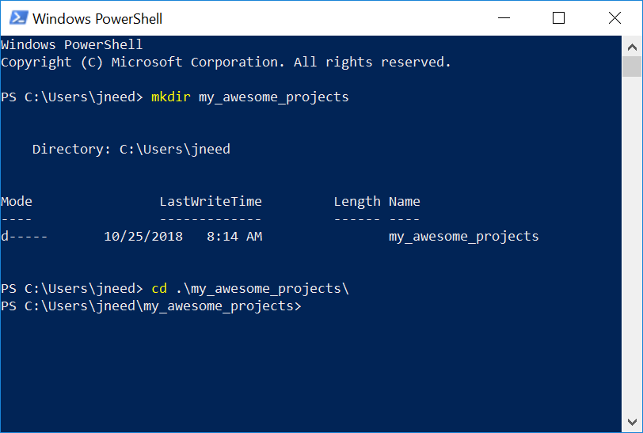
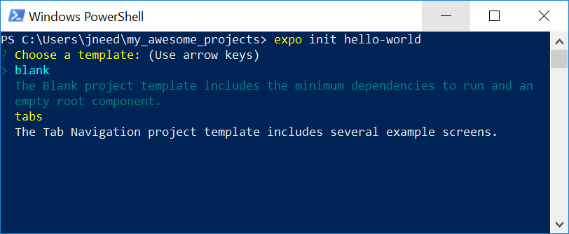
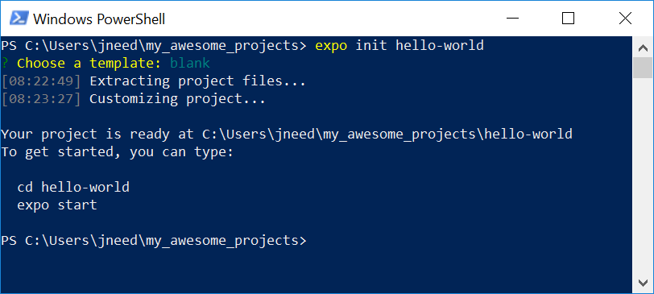
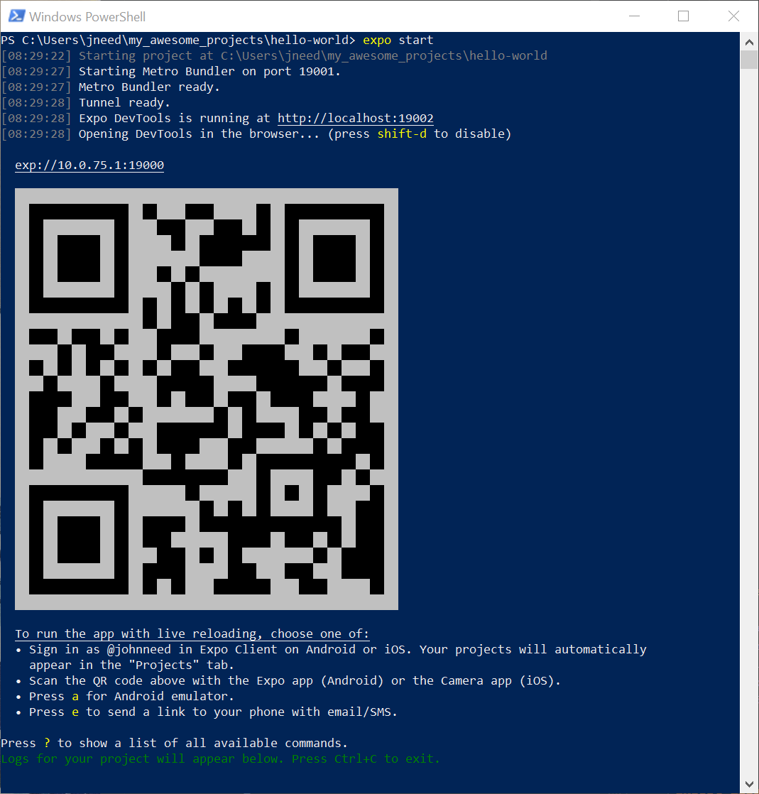
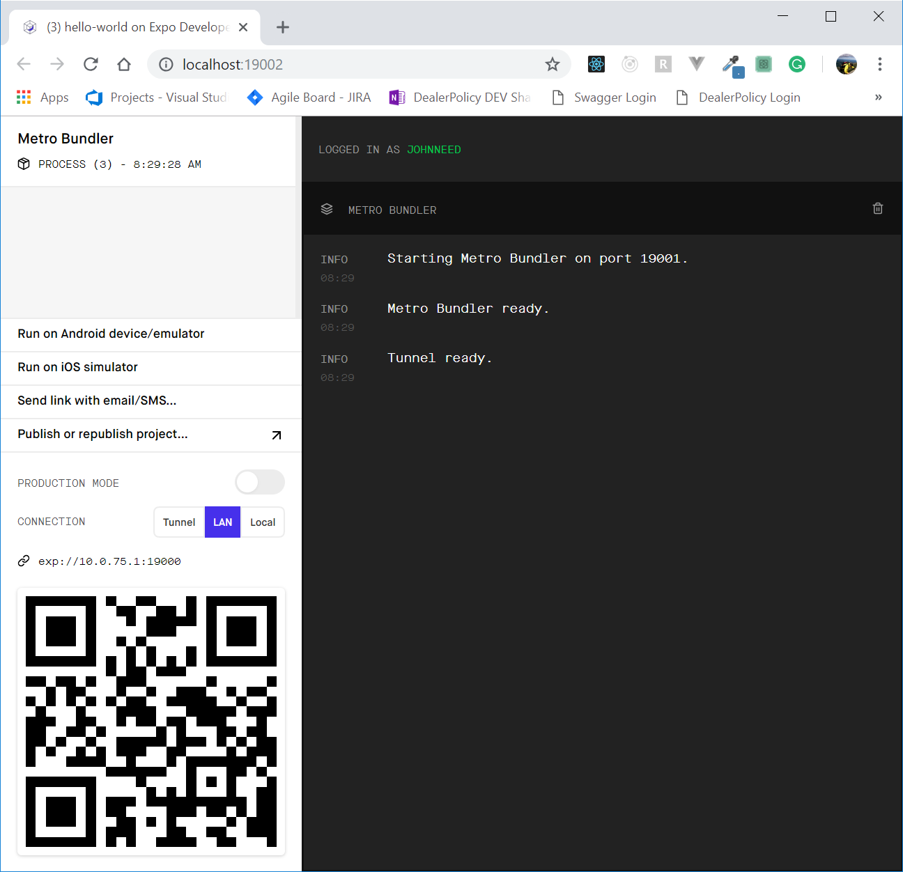
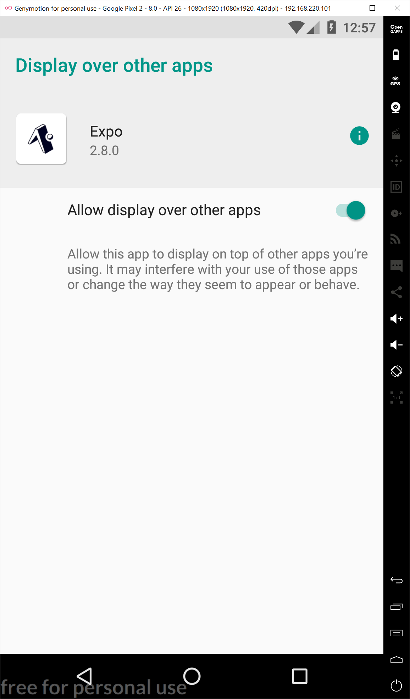
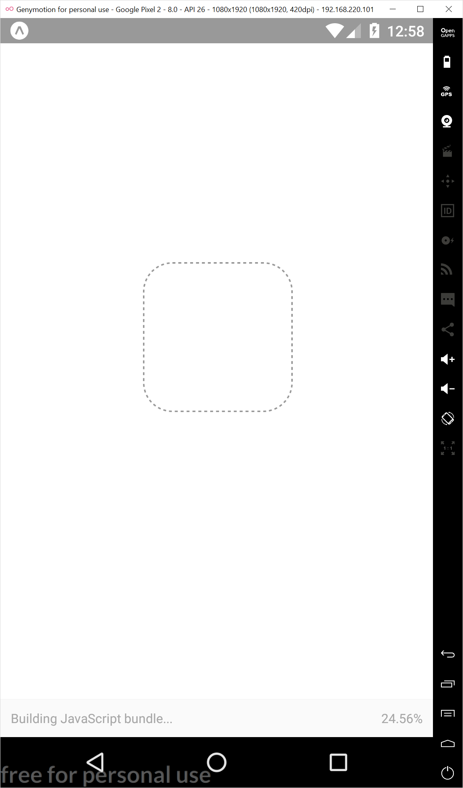
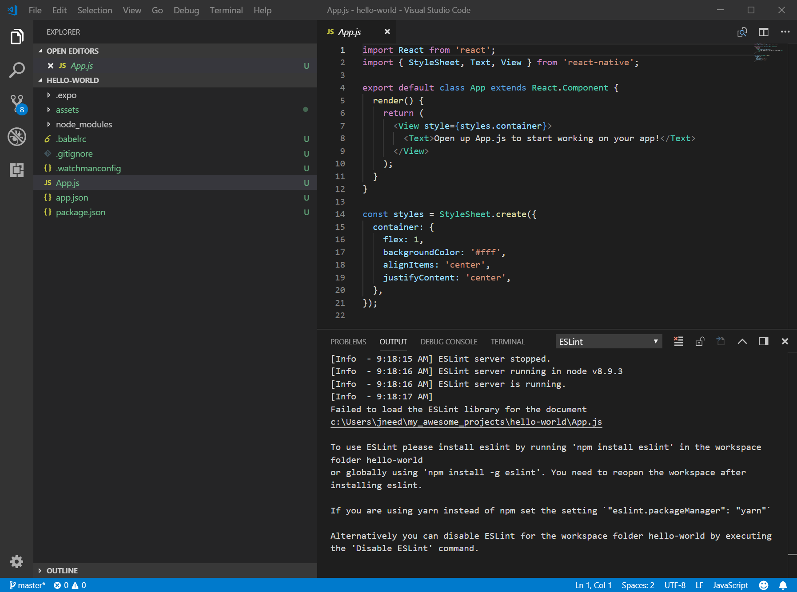
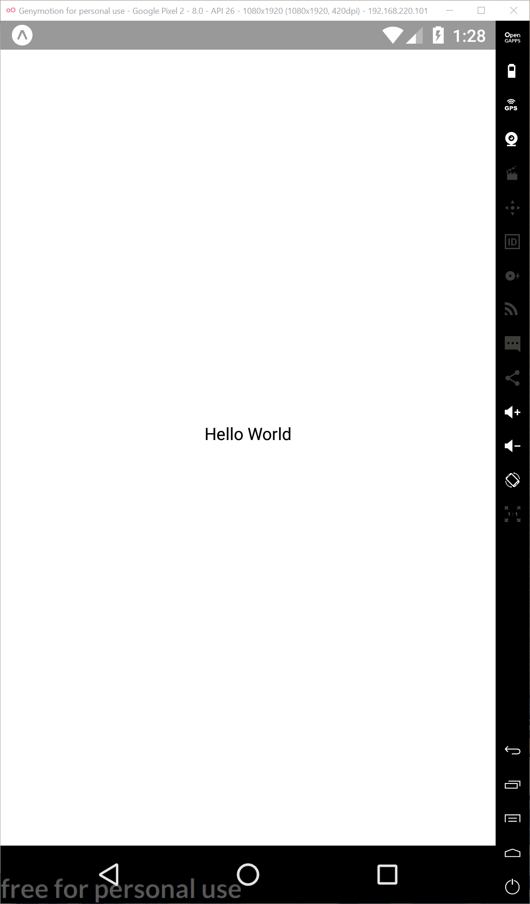

# Hello World Expo Style

Now that you have your development environment setup, we can start building our first mobile application, "Hello World"

Start by opening a terminal. Then create a folder where you want to keep your projects. I'm calling my project directory "my_awesome_projects"



Navigate into your projects folder and execute this command

```
expo init hello-world
```

You should be prompted to "Choose a template.




"Hello World" is a super simple app, so we won't need tab-navigation. Hit 'enter' to accept the default template, 'blank.'  Expo will now extract the files you need and setup your app.  




After everything is done installing, Expo will give you instructions on how to start your app.  Type these two commands:

    cd hello-world
    expo start




You should see a UPC symbol in your terminal.  In addition, the Expo Chrome dev tools should open in a Chrome window. You can toggle the Expo Chrome dev tools by pressing 'd' in the Expo terminal.  You don't need the Chrome dev tools, but it provided a more graphical interface to debugging your app.  we'll include instructions for using both.




Lets see what our app looks like.  Open Genymotion and start a virtual device.  After your virtual device finishes booting up, type 'a' in the Expo terminal window to launch your app in the emulator.  Alternatively, you can click the "Run on Android device/emulator" button in the Chrome Dev Tools windows

The first time you launch your app in an emulator Expo will install the Expo client.  When this is finished you will be prompted to 'Allow display over other apps.'  Set the toggle to 'on' then click the back button   on the right side to return to your app. 

 

 

 


 








import React from 'react';
import { StyleSheet, Text, View } from 'react-native';

export default class App extends React.Component {
 render() {
   return (
     <View style={styles.container}>
       <Text>Hello World</Text>
     </View>
   );
 }
}

const styles = StyleSheet.create({
 container: {
   flex: 1,
   backgroundColor: '#fff',
   alignItems: 'center',
   justifyContent: 'center',
 },
});
