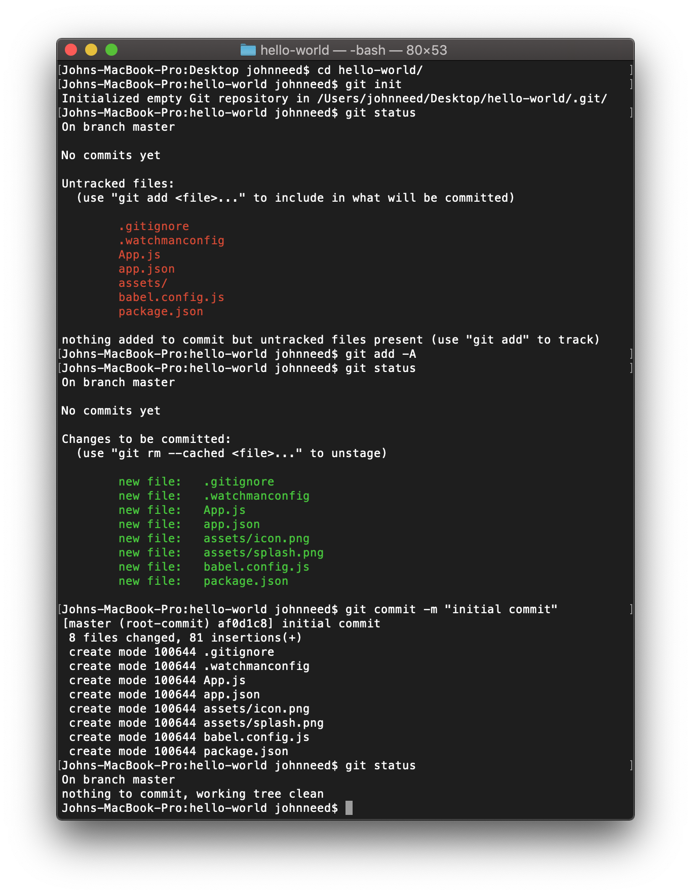

## Creating a New Repository

Now that you have your new app, let's save your code, in case something bad happens to your computer.  It's also the best way to share your awesome code with your adoring fans.

To create a new Git repository open a terminal, cd into the root of your project, and initialize your new repository with this command:

```bash
cd hello-world
git init
```

Now check the status of your respository

```bash
git status
```

You should see a list of files are untracked.  Let add these file to git so they can be tracked.  The '-A' means 'add all changes'

```bash
git add -A
```

Execute the `git status` command again.  You should that your files are now being tracked and ready to be committed. Commit your changes to your new repository and add a message showing this is your first commit.

```bash
git commit -m 'initial commit'
```

Execute `git status` one more time.  You should there no file with changes pending.


Here's what it looks like in the terminal:




