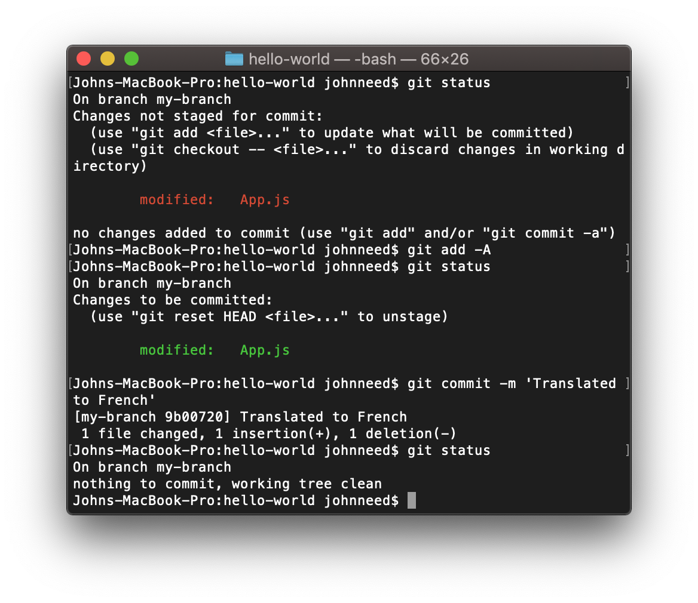

# Committing

Now that you're using your new branch, it's time to change some code.  Open up App.js and change 'Hello World' to 'Bonjour tout le monde.' and then save the file.
Verify that you have changes by executing:

```bash
git status
```

You should see that you have changes.  Add those changes to the next commit with this command.

```bash
git add -A
```

Try `git status` again to see those changes are ready to be committed.  Finally commit the changes to your local repository with the commit command.

```bash
git commit -m 'Translated to French'
```

the -m parameter allows you to include a commit message.  You could have left if off, but then you would have been prompted to include one.  The default text-editor is VIM which for some is hard to use so most find easier to add the message along with the commit command.


