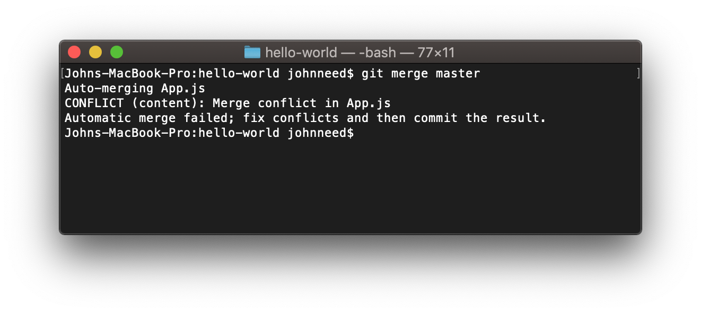
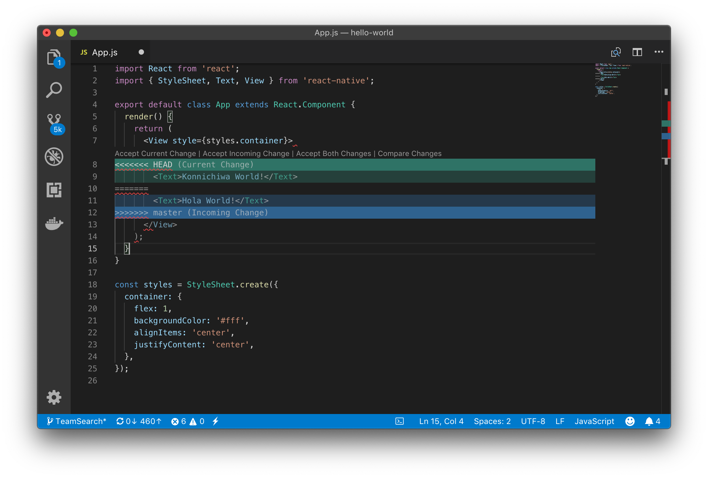

## Resolving Conflicts

Despite out best intentions, sometimes we make changes that can't be automatically merged.  If two developers edit the same line of code Git will require a manual resolution. When you pull code that conflicts with your own edits, Git will alert to which files needs resolving and mark the conflicts.


 


 


```
<<<<<<< HEAD
        <Text>Konnichiwa World!</Text>
=======
        <Text>Hola World!</Text>
>>>>>>> master
```