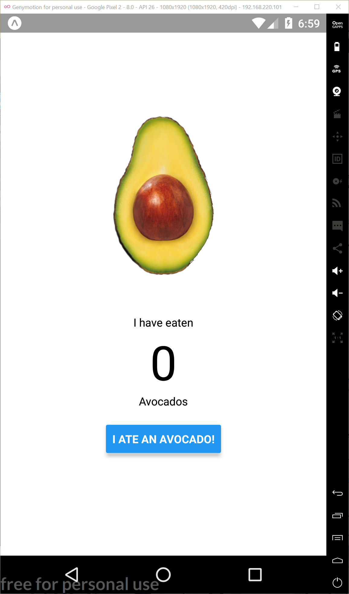

# Lesson Four: A Basic App

Hello World is an awesome app but it doesn't do much.  I like for my mobile apps to do stuff, so let's a build an app that counts how many avocados you eat during your lifetime.  That's useful, isn't it?

By the way, Here's where you can find [all the code for Avocado App](../code-samples/avocado).

   1. [View, Text and Button Components](01_View-Text-and-Button-Components.md)
   2. [Styling Components](02_Styling-Components.md)
   3. [React Props](03_React-Props.md)
   4. [React State](04_React-State.md)

 
Here's the app you'll build.  

It's pretty simple. Every time you eat an avocado you click the "I ate an avocado" button and the app will keep track of your avocado intake.

Now let's get started.

