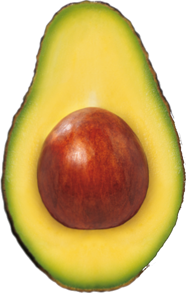

# Lesson Four: A Basic App (30 min)
   1. [View, Text and Button Components](01_View-Text-and-Button-Components.md)
   2. [Styling Components](02_Styling-Components.md)
   3. [React Props](03_React-Props.md)
   4. [React State](04_React-State.md)

[Assets and code samples for Code for BTV's mobile stack training]()
 

