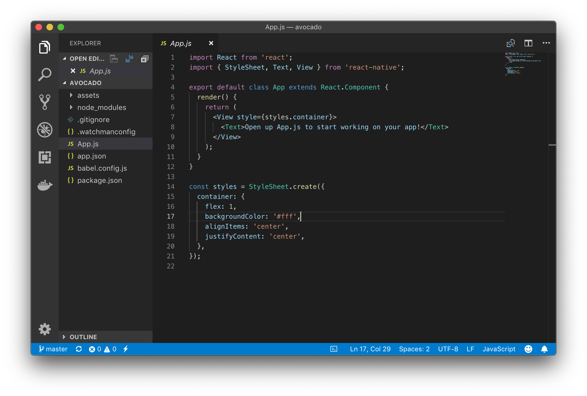

## View, Text and Button Components

This is a new app, so let's start from scratch.  

create a folder where you want to keep your code and then create a new app called avocado.

```bash
expo init avocado
```

Choose the 'blank' template when prompted.

Next, cd into the app and initialize a Git repository.

```bash
cd avocado
git init
```

Now go to GitHub and create a repository called "avocado."  Get the URL and issues the this command substituting your URL.

```bash
git add -A
git commit -m "first commit"
git remote add origin https://github.com/codeforbtv/avocado.git
git push -u origin master
``` 

Woot! now that we have a project, lets create an awesome app.


Launch Visual Studio Code, click File -> Open and select your avocado folder. Your Project should now appear in the Explorer window.  Open the App.js file.




Our New App doesn't have many controls.  We'll need an Image and a Button in addition to the three Text Controls to build out app.  Before we can use a Control we need to import it.
We already have a Text Control imported so well import the Image and Button controls.  Edit line to so it includes a Button and an Image

Change it from this :

```import { StyleSheet, Text, View } from 'react-native';```

to this 

```import { StyleSheet, Text, View, Button, Image } from 'react-native';```

All the controls we need are now available.  Let's start by adding an image,

We'll need three images the avocado, and our new splash screen and our new icon.  [You can download them here](../code-samples/avocado/assets/).  Drop them into you assets folder, replacing anything that's already there. 


