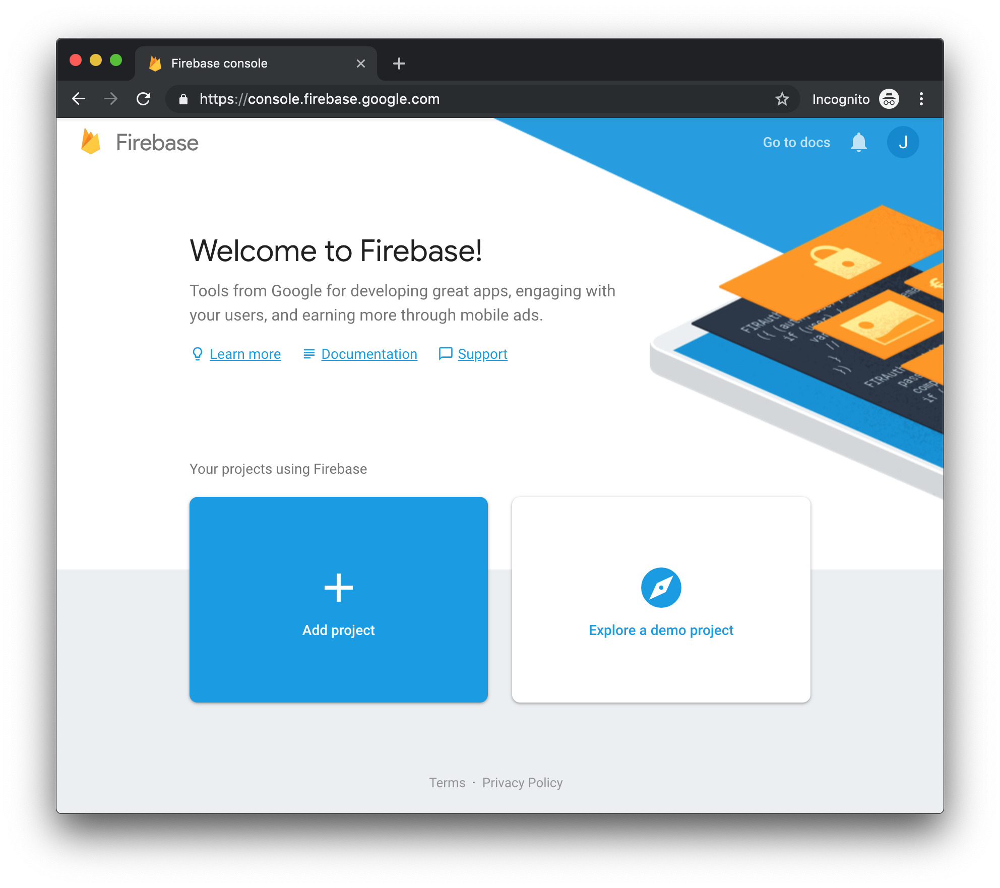
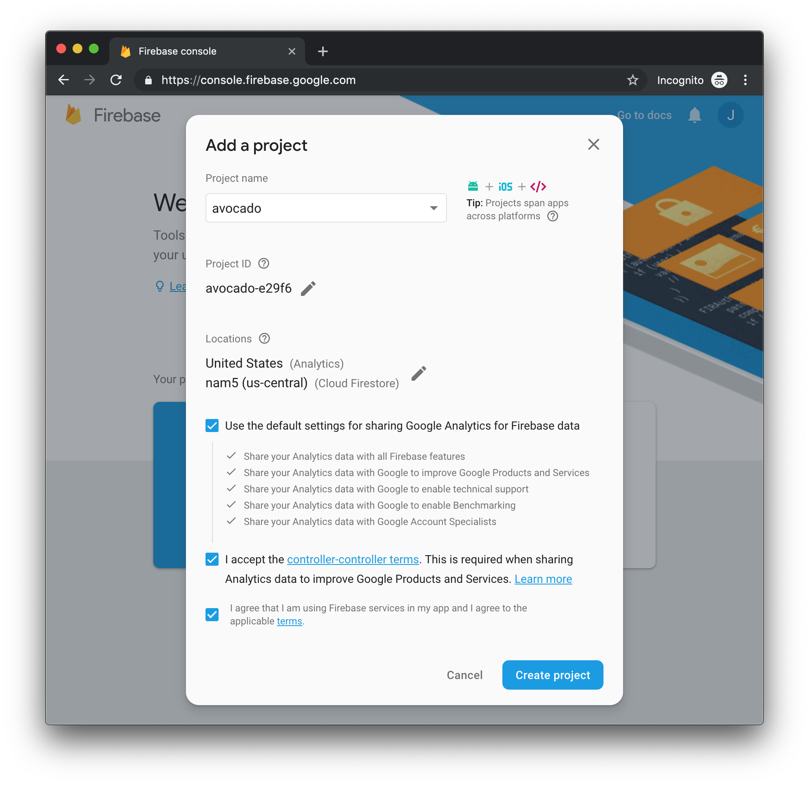
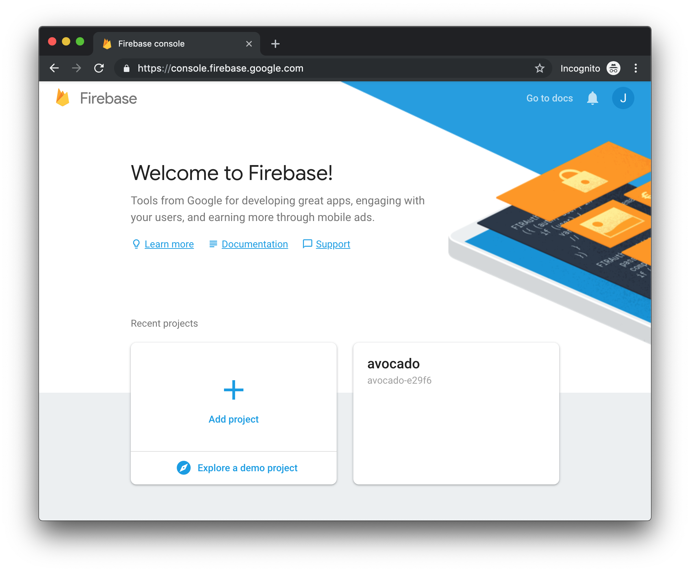
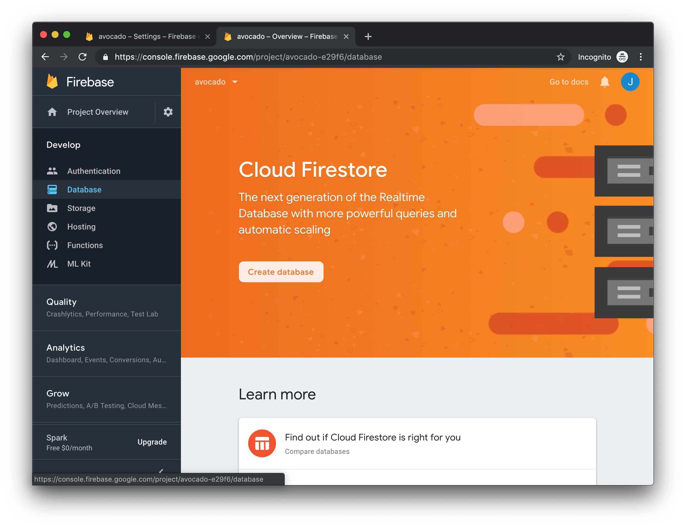
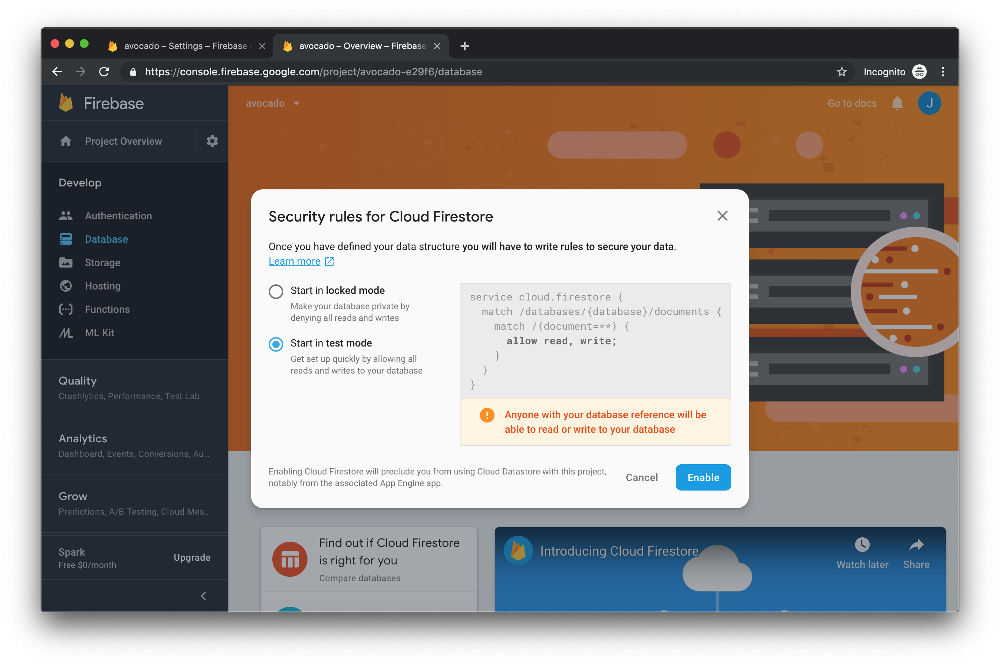
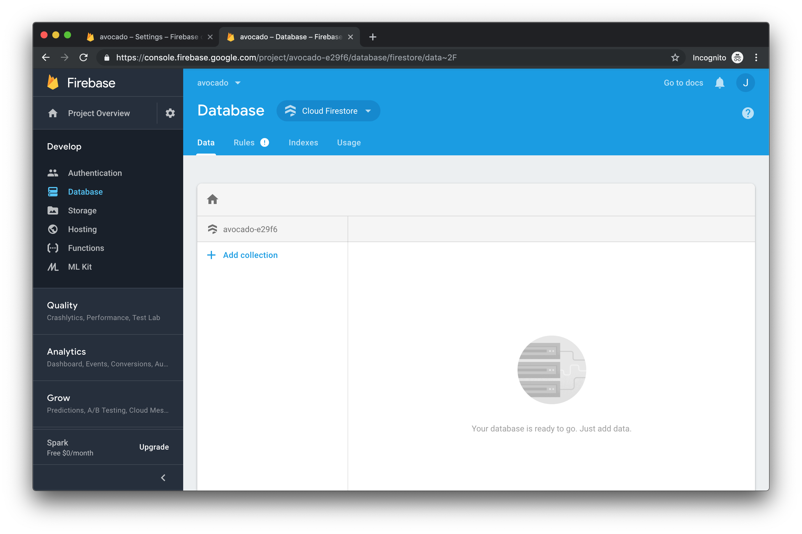

#Getting Started with Firebase

To get started, go to [Firebase Console](https://console.firebase.google.com ) and click the "Sign In" button,  You'll need a free Google Account.  If you don't have one, you'll see a handy link for creating one. Once you're loggec in click the big "Add Project" button.

